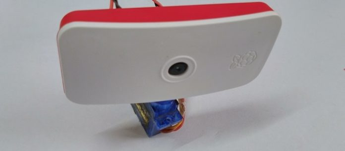

# IOT 101
Internet of things is one of the most booming areas of the 21st century. It is present in every device we use and is shaping our lives.

## Content
*1. RTSP Video Stream
*2. Cloud push
*3. BLE aggrigator architecture
*4. Machine Learning processing
*5. Requests introduction
*6. Applying Deep Learning on Video Streams
*7. Using Color Space transformations to build a simple day and night detector

### 1.RTSP Video Stream
In this project we will use RTSP to stream video over a Wi-Fi interface. The main hardware we would use is going to be a raspberry pi. The only requirement is that the raspi should have a camera and Wi-Fi capability. The image below is a raspberry pi zero configure as a stream device.

